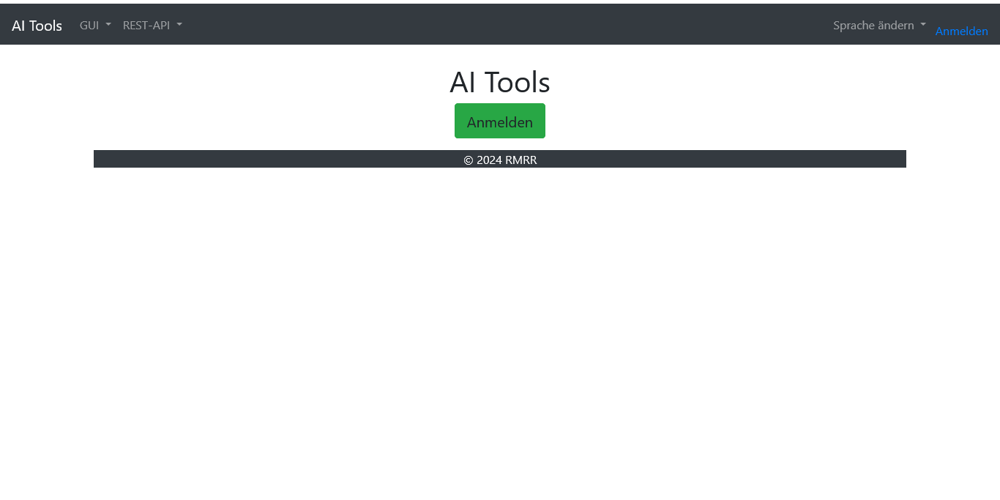

# AI Tools
Tools for streamlining converting images into a training dataset. 

[Files list](files.md)

## Screen shots
### Common screens

Login screen

English home screen

German home screen

French home screen

### Admin screens
#### Account screens
Account list screen

Account new screen

Account edit screen

### User screens
#### Pics screens
Pics list screen

Pics new screen

Pics edit screen

#### Detections screens
Detections list screen

Detections new screen

Detections edit screen

#### Classes screens
Classes list screen

Classes new screen

Classes edit screen

